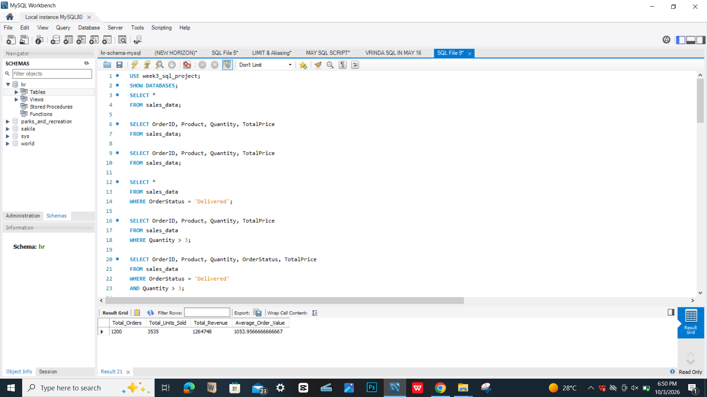
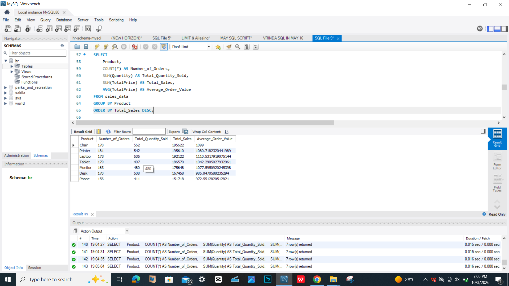
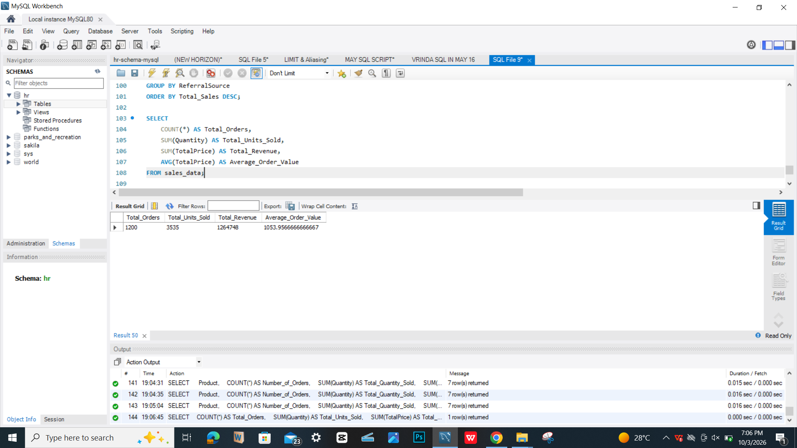

# Week 3 SQL Data Analysis Project

## Project Overview

For Week 3 of my data analytics training, I used **MySQL Workbench** to analyze a cleaned e-commerce dataset and extract meaningful insights using SQL.

The project focused on applying SQL fundamentals to retrieve, filter, sort, group, and summarize data.

---

## Project Objective

The main objective of this project was to use SQL queries to extract insights from an e-commerce dataset.

The analysis focused on:

- Retrieving data using `SELECT`
- Filtering records using `WHERE`
- Sorting results using `ORDER BY`
- Grouping data using `GROUP BY`
- Performing basic aggregations using `COUNT()`, `SUM()`, and `AVG()`

---

## Dataset Overview

The dataset contains **1,200 orders** across **14 columns**, including:

- Order ID
- Date
- Customer ID
- Product
- Quantity
- Unit Price
- Payment Method
- Order Status
- Items in Cart
- Coupon Code
- Referral Source
- Total Price

The dataset contains several order statuses, including Cancelled, Returned, Pending, Shipped, and Delivered.

---

## Tools Used

- **MySQL**
- **MySQL Workbench**
- **SQL**

---

## SQL Skills Demonstrated

| SQL Skill | Purpose |
|---|---|
| `SELECT` | Retrieve data from the table |
| `WHERE` | Filter records based on conditions |
| `ORDER BY` | Sort query results |
| `GROUP BY` | Group records for analysis |
| `COUNT()` | Count records/orders |
| `SUM()` | Calculate totals |
| `AVG()` | Calculate averages |

---

## Analysis Performed

### 1. Data Retrieval

Used `SELECT` statements to inspect the dataset and retrieve specific columns.

### 2. Data Filtering

Used `WHERE` to identify records based on conditions, including delivered orders and orders with specific quantities.

### 3. Data Sorting

Used `ORDER BY` to arrange orders based on total order value.

### 4. Product Analysis

Used `GROUP BY` with `COUNT()`, `SUM()`, and `AVG()` to compare product performance.

### 5. Payment Method Analysis

Analyzed the number of orders, total order value, and average order value across payment methods.

### 6. Order Status Analysis

Grouped orders by status to understand the distribution of cancelled, returned, pending, shipped, and delivered orders.

### 7. Referral Source Analysis

Compared order activity and total order value across different referral sources.

---

## Key Insights

### Overall Dataset

- **Total Orders:** 1,200
- **Total Units Ordered:** 3,535
- **Total Order Value:** 1,264,748
- **Average Order Value:** 1,053.96

### Product Performance

| Product | Number of Orders | Units Ordered | Total Order Value | Average Order Value |
|---|---:|---:|---:|---:|
| Chair | 178 | 562 | 195,622 | 1,099.00 |
| Printer | 181 | 542 | 195,610 | 1,080.72 |
| Laptop | 173 | 535 | 192,122 | 1,110.53 |
| Tablet | 179 | 497 | 186,570 | 1,042.29 |
| Monitor | 163 | 480 | 175,648 | 1,077.60 |
| Desk | 170 | 508 | 167,458 | 985.05 |
| Phone | 156 | 411 | 151,718 | 972.55 |

### Other Findings

- Chair recorded the highest total order value at **195,622**, closely followed by Printer at **195,610**.
- Laptop recorded the highest average order value at approximately **1,110.53**.
- Credit Card recorded the highest total order value among payment methods at **263,845**.
- Online payments had the highest number of orders with **258 orders**.
- Cancelled orders were the most frequent order status with **250 orders**.
- Instagram recorded the highest number of orders (**259**) and the highest total order value (**275,285**) among referral sources.

---

## Project Files

- `week3_sales_analysis.sql` — SQL queries used for the analysis.
- `Cleaned_Dataset_for_Data_Analytics.csv` — dataset used for the SQL analysis.
- `screenshots/` — screenshots of the SQL queries and results.

---

## Screenshots

### SQL Queries

### Product Analysis

### Overall Summary

---

## Conclusion

This project strengthened my understanding of SQL fundamentals and how SQL can be used to explore structured data, identify patterns, and generate meaningful insights from a dataset.

The project demonstrates practical use of **data querying, filtering, sorting, grouping, and aggregation in MySQL**.
